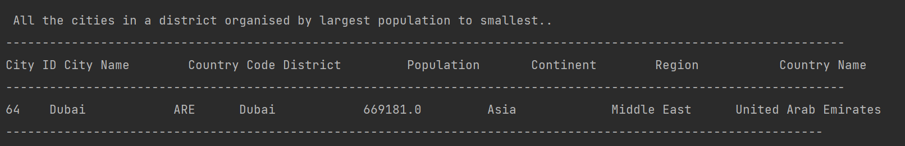
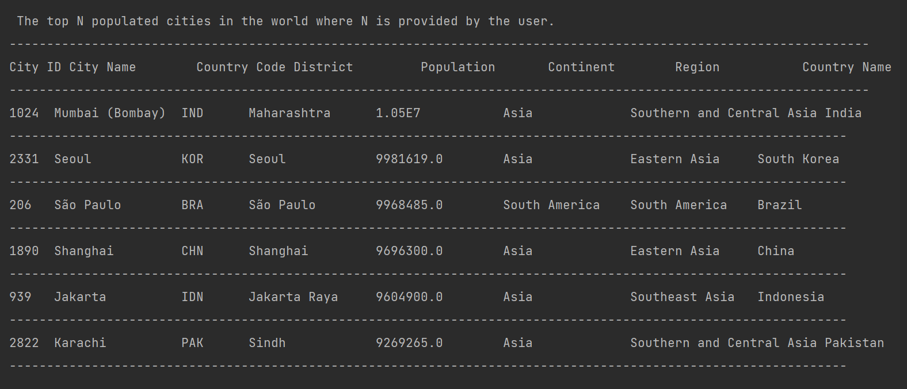
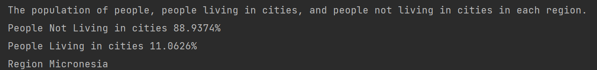

32 requirements of 32 have been implemented,which is 100% of requirements.

| ID | Name | Met | Screenshot |
| ----------- | ----------- | ----------- | ----------- |
| 1 | All the countries in the world organised by largest population to smallest. | Yes | 
| 2| All the countries in a continent organised by largest population to smallest. | Yes | 
| 3 | All the countries in a region organised by largest population to smallest. | Yes | 
| 4 | The top N populated countries in the world where N is provided by the user. | Yes | 
| 5 | The top N populated countries in a continent where N is provided by the user. | Yes | 
| 6 | The top N populated countries in a region where N is provided by the user. | Yes | 
| 7 | All the cities in the world organised by largest population to smallest. | Yes | 
| 8 | All the cities in a continent organised by largest population to smallest. | Yes | 
| 9 | All the cities in a region organised by largest population to smallest. | Yes | 
| 10 | All the cities in a country organised by largest population to smallest. | Yes | 
| 11 | All the cities in a district organised by largest population to smallest. | Yes | 
| 12 | The top N populated cities in the world where N is provided by the user. | Yes | 
| 13 | The top N populated cities in a continent where N is provided by the user. | Yes | 
| 14 | The top N populated cities in a region where N is provided by the user.| Yes | 
| 15 | The top N populated cities in a country where N is provided by the user. | Yes | 
| 16 | The top N populated cities in a district where N is provided by the user. | Yes | 
| 17 | All the capital cities in the world organised by largest population to smallest. | Yes | 
| 18 | All the capital cities in a continent organised by largest population to smallest. | Yes | 
| 19 | All the capital cities in a region organised by largest to smallest. | Yes | 
| 20 | The top N populated capital cities in the world where N is provided by the user. | Yes | 
| 21 | The top N populated capital cities in a continent where N is provided by the user.| Yes | 
| 22 | The top N populated capital cities in a region where N is provided by the user. | Yes | 
| 23 | The population of the world. | Yes | 
| 24 | The population of a continent. | Yes | 
| 25 | The population of a region. | Yes | 
| 26 | The population of a country. | Yes | 
| 27 | The population of a district. | Yes | 
| 28 | The population of a city. | Yes | 
| 29 | The population of people, people living in cities, and people not living in cities in each continent. | Yes | 
| 30 | The population of people, people living in cities, and people not living in cities in each region. | Yes | 
| 31 | The population of people, people living in cities, and people not living in cities in each country. | Yes | 
| 31 | Finally, the organisation has asked if it is possible to provide the number of people who speak the following the following languages from greatest number to smallest, including the percentage of the world population:Chinese,English,Hindi,Spanish and Arabic.| Yes | 

